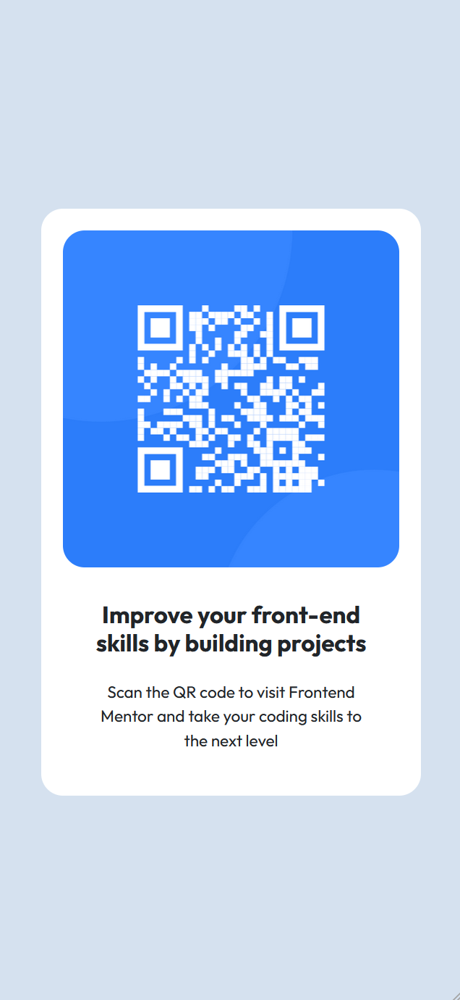
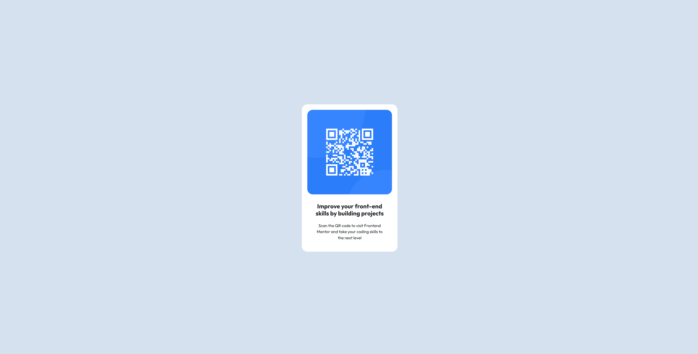

# Frontend Mentor - QR code component solution

This is a solution to the [QR code component challenge on Frontend Mentor](https://www.frontendmentor.io/challenges/qr-code-component-iux_sIO_H). Frontend Mentor challenges help you improve your coding skills by building realistic projects. 

## Table of contents

- [Overview](#overview)
  - [Screenshot](#screenshot)
- [My process](#my-process)
  - [Built with](#built-with)
  - [What I learned](#what-i-learned)
  - [Continued development](#continued-development)
  - [Useful resources](#useful-resources)
- [Author](#author)

## Overview

### Screenshot




## My process

### Built with

- CSS custom properties
- Flexbox
- CSS Grid
- Mobile-first workflow
- [Bootstrap](https://getbootstrap.com) - CSS Mobile First Library
- [Google Fonts](https://nextjs.org/) - Massive Font Library

### What I learned

Some major things I learned in this project was centering divs vertically. It seems like a basic thing and I'm sure there's a much better way of doing this in the future but this method seems to work and would work in future projects though I may look to improve upon this in my upcoming projects.

I used some very basic img tags but it helped me learn some of the attributes that an img tag can have

```html

```

This was the css I used to vertically and horizontally align my div containing the QR code.

```css
section .container {
    position: relative;
}

section .container .qr-modal {
    position: absolute;
    top: 50%;
    left: 50%;
    transform: translate(-50%, -50%);\
}
```

### Continued development

In the future I want to focus on better understanding html and css remembering attributes and increasing on my understanding of bootstrap to make mobile first-platforms.

### Useful resources

- [W3 Schools](https://www.w3schools.com) - This helped me with img tag attributes and vertically centering the div on the page.
- [Bootstrap](https://getbootstrap.com) - This was a great tool for making mobile and desktop responsiveness with a mobile-first design.

## Author

- Website - [Dudley Seddon](https://dudleyseddon.com)
- Frontend Mentor - [@Dudamania](https://www.frontendmentor.io/profile/Dudamania)
- Twitter - [@dudleyseddon](https://www.twitter.com/dudleyseddon)
